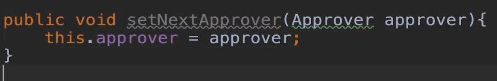

已创建课程为例
1. 创建课程类Course
2. 创建批准者Approver
   1. **责任链模式的批准者， 要声明一个自己类型的批准者 ，有些写法会声明成handler**
   2. 设置下一个批准者  传入approver
   3. 再写一个deploy方法，发布课程 ，这个方法教给子类实现，用来做各种的校验，这里是抽象类
4. 再写一个实现，继承Approver
   1. 重写deploy方法，做各种校验(如果不是空，就是通过，然后调用下一个批准者的deploy方法)
   2. 重写setNextApprover方法，设置下一个批准者